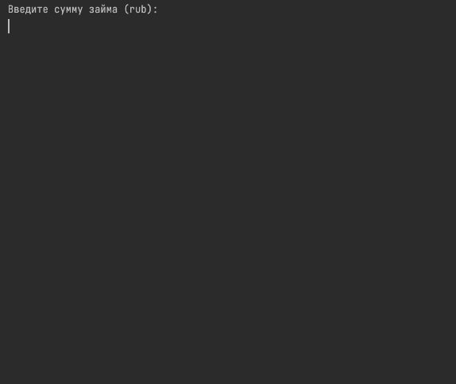

# Cinema.
My implementation of a calculator for the provision of a mortgage by the bank. It implements such things as
- payment per month
- mortgage overpayment
- payment schedule

+ The system is implemented in Java.

[comment]: <> (![Administrator portal 2]&#40;./resources/admin_2.jpg&#41;)

